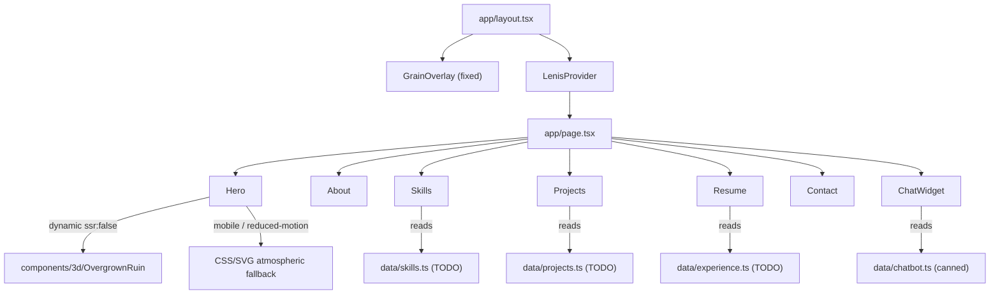

# Portfolio-2027 — The Last of Us-Inspired Frontend Build

## Locked Decisions (do not re-litigate)

- **Location:** `~/Projects/portfolio-2027` (create `~/Projects` if missing).
- **Theme:** The Last of Us-**inspired** only. Overgrown post-civilization mood, muted survival-era palette, quiet devastation. No game assets, logos, or character likeness. See Copyright Guardrails.
- **Scope:** Frontend only. No backend, no auth, no DB, no API routes, no deploy config (no `vercel.json`, no Firebase, no CI). Local dev project.
- **Stack (pinned to current stable, Sep 2026):**
  - Next.js 15 App Router + React 19 + TypeScript 5
  - Tailwind CSS v4
  - `@react-three/fiber@9` + `@react-three/drei` + `three` (paired with React 19)
  - `framer-motion` for UI transitions
  - `gsap` 3.12+ + `@gsap/react` (`useGSAP`) for scroll-driven sequences
  - `lenis` 1.3+ (use `lenis/react`) for smooth scroll
  - `lucide-react` icons
  - `next/font` for self-hosted Google Fonts (no CDN fetch at runtime)

## Copyright Guardrails (non-negotiable)

- No Naughty Dog / Sony / PlayStation logos, screenshots, character art, silhouettes, or names (Joel, Ellie, Fireflies, etc.) in any string, alt text, filename, or route.
- No ripped textures, models, sound, or fonts. All 3D geometry is original low-poly/stylized.
- Fonts must be free/OFL/Apache-licensed (Fraunces, Zilla Slab, Inter, Source Sans all OK).
- Palette is generic-muted-survival — do not caption anything with game character names or game titles in the shipped UI. Internal code comments may reference the vibe.

## Design System (locked)

- **Palette (Tailwind tokens):**
  - `bg.base` `#1A1A18` (near-black charcoal)
  - `bg.raised` `#242420` (slightly lighter surface)
  - `earth.moss` `#3D4A34` (desaturated moss green)
  - `earth.rust` `#8B4A32` (rust/clay)
  - `earth.teal` `#4A6B6B` (muted teal)
  - `text.primary` `#E8E4D8` (warm off-white)
  - `text.muted` `#9A9688` (faded parchment)
- **Type:** Display = Fraunces (variable, via `next/font/google`, `display: 'swap'`) — slightly worn, humanist serif for headings. Body = Inter. Dial in scale, line-height, and tracking in Phase 1.
- **Motion vocabulary:**
  - "Grow in" section reveals — scale from 0.95 + opacity 0 with organic ease-out (like vines uncurling)
  - Slow dissolve/fade page and nav transitions — nothing snappy or flashy
  - Subtle film grain + vignette CSS overlay on the page (composited via `mix-blend-mode` or pseudo-element with noise SVG)
  - Hover states: soft warm glow or gentle lift, restrained
  - Drifting dust/spore particles in hero (R3F or CSS)
- **All motion respects `prefers-reduced-motion`** — provide static fallback for every animated component.

## Repo Layout

```
portfolio-2027/
  app/
    layout.tsx
    page.tsx
    globals.css
  components/
    3d/                      # R3F components, all 'use client'
    motion/                  # framer-motion + gsap primitives
    ui/                      # buttons, cards, nav, chat widget, grain overlay
  sections/                  # Hero, About, Skills, Projects, Resume, Contact
  data/                      # projects.ts, skills.ts, experience.ts, socials.ts (all TODO placeholders)
  lib/                       # hooks (useReducedMotion, useMediaQuery), utils
  public/
    placeholders/            # resume.pdf placeholder, project screenshots
  PLAN.md                    # this file, copied in
  PROGRESS.md                # one entry per completed phase
  DECISIONS.md               # locked choices, do-not-change list
```

## Continuity Files (create in Phase 0, update every session)

- **`PLAN.md`** — verbatim copy of this plan.
- **`DECISIONS.md`** — theme, palette hex values, font choices, stack versions, folder conventions, "no deploy config", "no real backend". Anything future sessions must not re-decide.
- **`PROGRESS.md`** — for each completed phase: what shipped, what's stubbed, known issues, TODOs. Update at end of every session.
- **Session opener prompt:** *"Read `PLAN.md`, `DECISIONS.md`, `PROGRESS.md` before continuing. Resume from the next incomplete phase in `PROGRESS.md`. Do not start subsequent phases until I confirm."*

## Critical R3F + Next.js Rules (bake in from Phase 0)

- All R3F components live in files marked `'use client'`.
- The 3D scene is imported into pages via `next/dynamic` with `{ ssr: false }` and a same-height loading placeholder (prevents CLS + hydration mismatch).
- Add `transpilePackages: ['three']` to `next.config.ts`.
- Use `dpr={[1, 2]}` on `<Canvas>`; use `frameloop="demand"` for the ambient scene if it only animates on scroll/timer.
- Dispose geometries/materials/textures on unmount to avoid GPU leaks across route changes.

## Lenis + GSAP Rules (bake in Phase 1)

- Single client provider (`components/motion/LenisProvider.tsx`) wraps `{children}` in root layout.
- Use `ReactLenis` from `lenis/react` with `options={{ autoRaf: false }}`.
- Drive Lenis + `ScrollTrigger` from `gsap.ticker` (one time base). Call `gsap.ticker.lagSmoothing(0)`.
- Register `ScrollTrigger` once at module level. Use `useGSAP` from `@gsap/react` for cleanup.
- Skip Lenis entirely when `prefers-reduced-motion: reduce`.

## Placeholder Data Convention

All swappable content lives in `data/*.ts` typed exports:

```ts
// data/projects.ts
export const projects = [
  { slug: 'todo-slug', title: 'TODO: Project title', /* ... */ }
];
```

Every placeholder string is prefixed `TODO:` so it's greppable.

---

## Phased Build (one phase at a time, confirm before advancing)

### Phase 0 — Scaffold
- `pnpm create next-app@latest portfolio-2027 --ts --tailwind --eslint --app --src-dir=false --import-alias "@/*"`
- Install: `three @react-three/fiber @react-three/drei framer-motion gsap @gsap/react lenis lucide-react`
- Dev: `@types/three`
- Create folder structure above.
- Add `transpilePackages: ['three']` in `next.config.ts`.
- Copy `PLAN.md`, create `DECISIONS.md` + `PROGRESS.md`.
- Verify `pnpm dev` boots on `localhost:3000` with default Next page.
- **Do not** create `vercel.json`, `.github/workflows`, or any deploy files.

### Phase 1 — Design System
- Tailwind v4 theme: color tokens (charcoal base, moss, rust, teal), font families, spacing scale.
- `app/layout.tsx`: `next/font` setup for Fraunces + Inter, dark theme base (`bg-base text-primary`), meta tags.
- `app/globals.css`: CSS variables mirroring tokens, `@media (prefers-reduced-motion: reduce)` global override, film-grain noise SVG background (subtle, composited via pseudo-element or `mix-blend-mode`), vignette radial gradient overlay.
- `components/motion/LenisProvider.tsx` per rules above; mount in root layout.
- `components/ui/GrainOverlay.tsx` — fixed-position grain + vignette layer (pointer-events: none).
- `lib/useReducedMotion.ts`, `lib/useMediaQuery.ts`.
- Primitives in `components/ui/`: `Button` (soft-glow hover), `SectionWrapper` (grow-in reveal), `NavBar` (slow dissolve transition), `Card`, `Badge`, `Heading`, `Text`.
- Typography pass — set the scale, line-height, letter-spacing. Fraunces headings should feel hand-lettered and weathered; body stays clean.

### Phase 2 — Hero + 3D Overgrown Ruin
- `sections/Hero.tsx` — name, role, one-line pitch, scroll cue (gentle downward arrow fade-pulse).
- `components/3d/OvergrownRuin.tsx` (`'use client'`) — original stylized low-poly decaying structure (think a crumbling wall segment with vines and grass geometry), drifting dust/spore particles (`drei` `<Sparkles>` or custom `Points`), slow ambient camera drift, muted green/teal ambient light, warm rust accent light. No textures beyond procedural noise.
- Import in Hero via `dynamic(() => import('@/components/3d/OvergrownRuin'), { ssr: false, loading: <RuinFallback /> })`.
- `<RuinFallback />` — same-height container with CSS gradient matching the mood (charcoal to moss) and a subtle grain, so there's no layout shift.
- Mobile fallback: CSS/SVG atmospheric scene (layered gradients, a simple vine/leaf SVG silhouette with drift animation) when viewport < 768px or `prefers-reduced-motion`.
- Nav bar slow dissolve transition on section scroll via `framer-motion` `AnimatePresence`.

### Phase 3 — About + Skills
- `sections/About.tsx` — bio placeholder tying gamer + developer identity (`TODO:` marked). "Grow in" reveal on scroll.
- `sections/Skills.tsx` — grid of skill items from `data/skills.ts`, each with quiet staggered grow-in via `useGSAP` + `ScrollTrigger`. Hover: soft warm glow border.
- Reduced-motion fallback: all items visible immediately, no animation.

### Phase 4 — Projects
- `sections/Projects.tsx` — card grid from `data/projects.ts` (3-4 placeholder entries).
- Card component: gentle hover lift + warm glow border, TODO screenshot slot in `public/placeholders/`.
- Cards accept `repoUrl`, `liveUrl`, `tags[]`, `description` — all `TODO:` stubs.
- Staggered grow-in on scroll entry.

### Phase 5 — Resume + Contact + Chatbot
- `sections/Resume.tsx` — timeline from `data/experience.ts`, "Download Resume" button linking `public/placeholders/resume.pdf` (empty stub file). Timeline items grow-in on scroll.
- `sections/Contact.tsx` — form UI only (name/email/message), submit is a no-op that shows a themed confirmation toast (warm off-white text on moss/charcoal). Include `mailto:` fallback link.
- `components/ui/ChatWidget.tsx` — floating widget bottom-right, themed in charcoal/moss/off-white, `useState` only, canned keyword responses from `data/chatbot.ts`. Clearly commented as placeholder for future real integration.

### Phase 6 — Performance and Accessibility Pass
- Audit bundle with `next build` + `@next/bundle-analyzer`; ensure 3D chunk is separate.
- Confirm every R3F import goes through `next/dynamic({ ssr: false })`.
- Lighthouse: target 90+ on Performance, Accessibility, Best Practices, SEO. Fix regressions.
- Accessibility sweep: color contrast (WCAG AA against `#1A1A18` — off-white `#E8E4D8` passes at 11.5:1; verify moss/rust/teal accent text is used only on large text or non-text elements), visible focus rings (teal or off-white outline), alt text on all images, semantic landmarks (`<header>`, `<main>`, `<section>`, `<footer>`), keyboard-only nav test.
- Reduced-motion fallbacks verified for every animated component (grain overlay stays, motion stops).
- Mobile QA: 3D swap-out under 768px, touch scroll smoothness.

### Phase 7 — Polish
- Micro-interactions: button press scale feedback, link underline draw-on animation, section anchor scroll offset.
- Typography fine-tune: Fraunces optical sizing at display scale, body measure (max 65ch), paragraph spacing.
- Cross-browser: Chrome, Safari, Firefox — verify WebGL fallback path, grain overlay rendering.
- Final `TODO:` sweep: every placeholder documented in `PROGRESS.md` with a swap-in checklist.

---

## Per-Phase Cursor Prompt Template

> "Implement **Phase [N]** from `PLAN.md`. Follow all rules in `DECISIONS.md`. When done, append an entry to `PROGRESS.md` describing what was built, what's stubbed with `TODO:`, and any known issues. Do NOT start Phase [N+1] until I confirm."

## Data Flow


